# 💰 ANALYTICAL BUDGET TRACKER

An analytical budget tracker made with [Flutter](https://flutter.dev/). 
You can input your name, your country's currency, budget date, 
an income source and an expense item. 
Be able to also view it in either List Form (smaller screens), 
and Table Form (bigger screens).
You can also visualize your budget in the Analytical Center

Click [here](https://analytical-budget-tracker.pages.dev) to see the web version immediately.

### If you want to build it on Windows 10/11:
- Make sure you have [Git For Windows](https://git-scm.com/install/windows) installed and can use it in a terminal.
- Copy the project somewhere in your computer:
```Powershell
git clone https://github.com/CodingDashUU/analytical_budget_tracker.git -b stable --depth 1
```
- Run in the integrated terminal of your IDE / text editor:
```Powershell
powershell.exe -ExecutionPolicy Bypass -File .\build_w.ps1
```

### Tech Stack:
- Language: [Dart](https://dart.dev/)
- Framework: [Flutter](https://flutter.dev/)
- State Management: [signals](https://pub.dev/packages/signals)
- Routing: [go_router](https://pub.dev/packages/go_router)
- Charts: [fl_charts](https://pub.dev/packages/fl_chart)
- Tables: [data_table_2](https://pub.dev/packages/data_table_2)
- Icons: [flutter_launcher_icons](https://pub.dev/packages/flutter_launcher_icons)

## Features:
### Budget Input
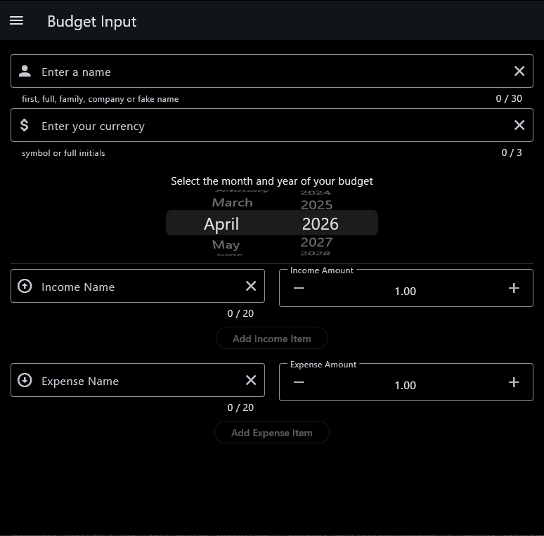
#### Details to enter:
- Name
  - Can be your first name, full name, company name, family name or even a fake name
  - Examples: John, Mark Franks, Bob's Tech, The Yann Family 
  - Can only contain lower- and uppercase characters, aswell as ' & - : and ,
  - Can only be up to 30 characters
- Currency
  - Due to the extensive amount of currencies in the world, I made it so you can type yours manually
  - Examples: $, ¥, £, USD, JPY, GBP
  - Can only contain non-digit characters
  - Can only be up to 3 characters
- Budget Date
  - The month and year of which you are recording your budget (usually at the end of the month when all your income and expenses are being recorded)
- As soon as you change these, they are immediately applied
### Income and Expense:
- Income and Expense Name:
  - Can only contain lower- and uppercase characters
  - Can only be up to 20 characters
- Income and Expense Amount:
  - Up to 2 places of decimal precision
  - Minimum Amount is 1
  - Maximum Amount is 1 000 000 000 (1 billion)
- Press the 'Add Income/Expense Item' button, when you do so, you get confirmation:
  - If it succeeds:
  
  - If the item/source already exists:
  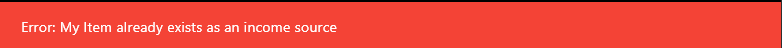
  - The Snackbar lasts for 1 second

### Budget Tables
- At the top, it displays your name, and the date of the budget, from fields you entered in the last screen
  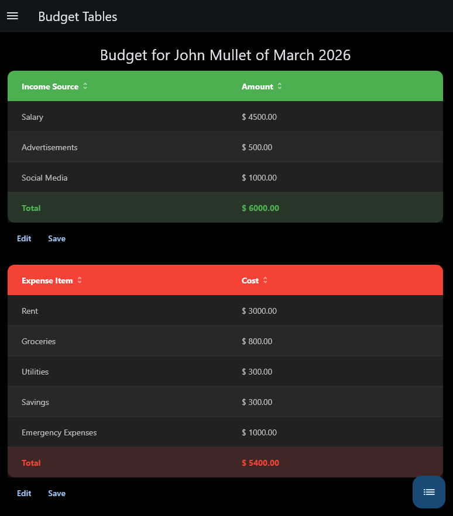
  - There are 2 ways your budget can be viewed
    - #### Tabular View
    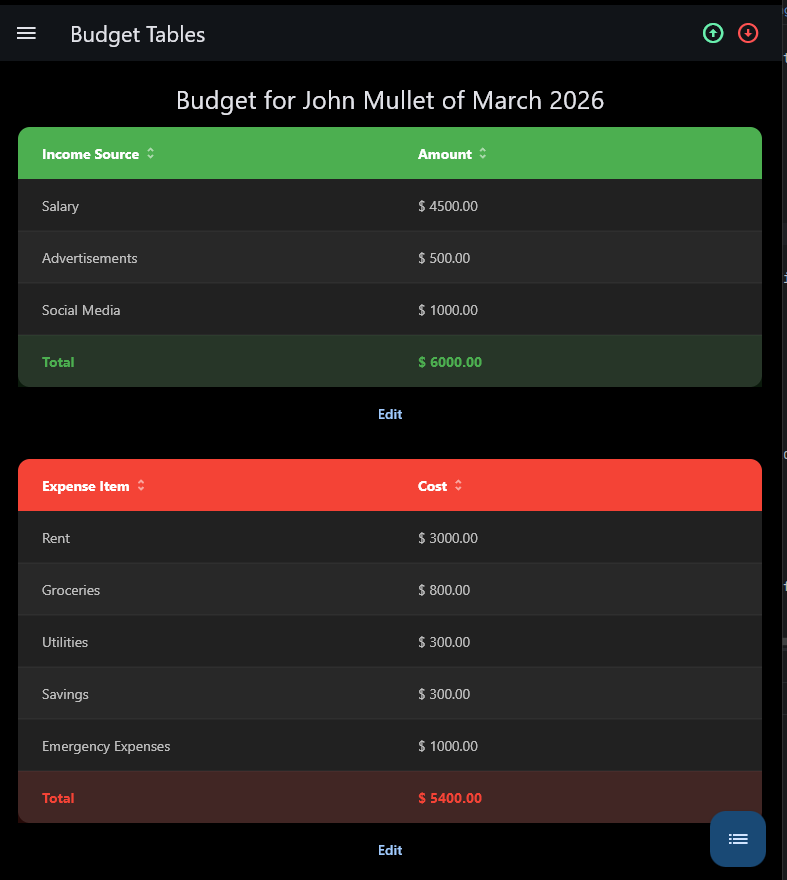
    - This view is only available for bigger screens
    - If your screen width is smaller than 600px, this won't be available for you
    - ##### The EDIT button
      - This is how you would delete your items
        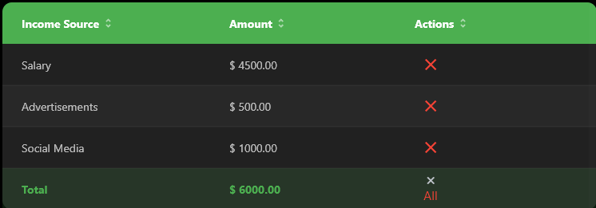
      - Pressing the normal X button next to each item would delete that item
      - Pressing the X All button next to Total would delete the entire table
      - There is no confirmation for any of this
    - ##### The SAVE button
      - Web
        - Will save your items to your Downloads folder as JSON
      - Windows
        - A file picker dialog will pop up, and will save your file to the file path specified
    - ##### The LOAD button
      - ###### Platforms:
        - Web
          - Not implemented
        - Windows
          - A file picker dialog will pop up, and will load the JSON file into the tables
      - ###### Validation:
        - If the JSON has invalid semantics, it will simply give the following error:
          
        - If the JSON is valid, but any JSON object doesn't contain the 'name' or 'amount' attribute, or the attributes
          are `null`, it will simply default to `"Item ${index}"` for `name`, or `1.0` for `amount`
        - If the amount is written in a string (eg "15") it will simply be converted to a `double`
        - If the amount is smaller than 1.0 or bigger than 1 000 000 000, then it will get clamped down automatically
        - If the type `name` is anything but `string`, it will be converted to a string
        - Any character that isn't a lower-, uppercase (a-z, A-Z) dash(-) or a whitespace character will be filtered out
          from `name`
        - Example JSON:
          ```json 
          [
            {"name" : "Salary", "amount": 30000},
            {"amount" : 5000, "name": "Groceries", "day" : 3},
            {"name" : null, "amount" : null},
            {},
            {"name" : true, "amount": false},
            {"name" : ["JSON", "Lists"], "amount" : -9999999999999},
            {"name" : {"name" : " Object", "amount": 99}, "amount": 999999999999999999999999999999},
            {"name": "Incomplete"},
            {"name" : "fake-number", "amount": "27"},
            {"invalid attribute" : 0},
            {"name": "!@#$%^&*()_-+=}][{:;|\\<,>.?/Interesting--()'' Values"}

          ]
          ```
          will transform into:
          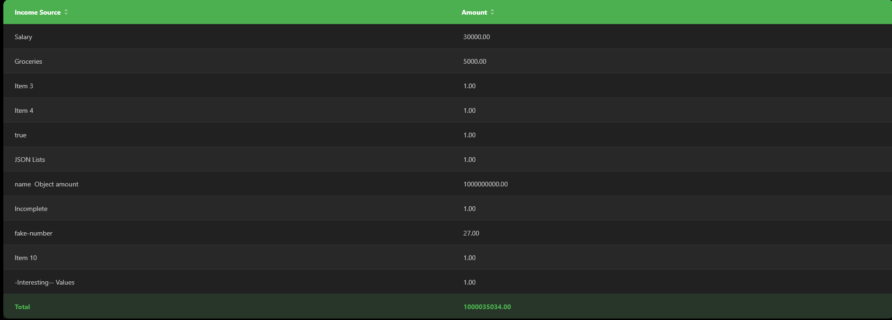
          - If the JSON isn't a list of JSON objects and instead is just a single one, the app will only load 1 budget
            item
            Example JSON:
          ```json 
            {"name" : "Salary", "amount": 30000}
          ```
          will transform into:
          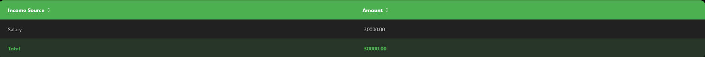
  - #### List View
  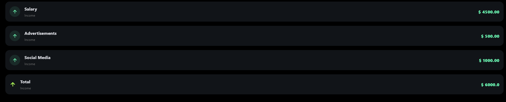
  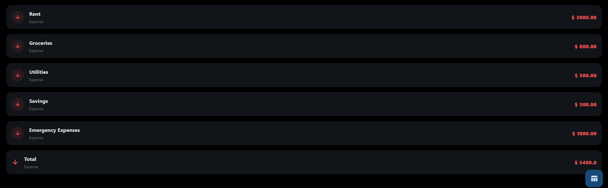
    - This is intended for screens smaller a width than 600px
  - If your screen is bigger you can optionally enable it with the FAB (Floating Action Button) in the bottom right
    corner of your screen
    - #### Deleting
      - To delete a specific item, just swipe it from the left to right
### Budget Analysis
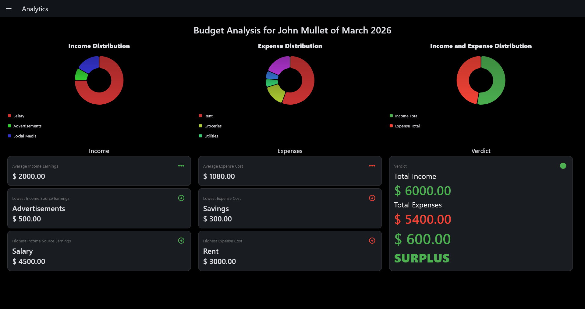
#### What's being analyzed?
- Income Distribution: Shows all your income sources in a chart
- Expense Distribution: Shows all your expenses in a chart
- Income and Expense Distribution: Shows your total income and total expenses in a chart
- Cards: 
  - ##### Income Cards
    - Average Income
    - Lowest Income amount (Income name + amount)
    - Highest Income amount (Income name + amount)
  - ##### Expense Cards
      - Average Expense
      - Lowest Expense amount (Expense name + amount)
      - Highest Expense amount (Expense name + amount)
  - ##### Verdict Card
    - Displays the following:
      - Total Income
      - Total Expenses
      - Take-home: Income - Expenses
      - Verdict
        - SURPLUS: If take-home is higher than 0
        - BREAKTHROUGH: If take-home is equal to 0
        - DEFICIT: If take-home is less than 0
#### Donut Charts
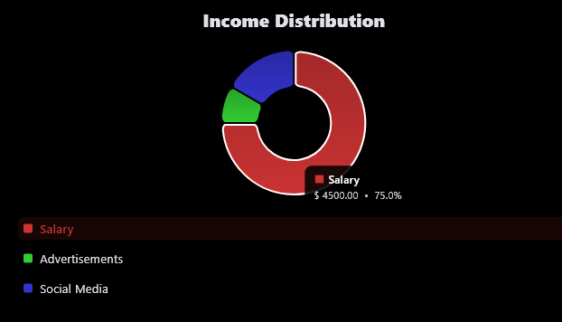
- Hovering over (or clicking on mobile) the donut chart will:
  - Outline the hovered (or clicked) slice
  - Highlight the name (as specified in the legend) in the color of the slice
  - Will show a tooltip of
    - The name of the item (as specified in the legend)
    - The amount of that item
    - What % it contributes to the final amount/cost

### Project Structure
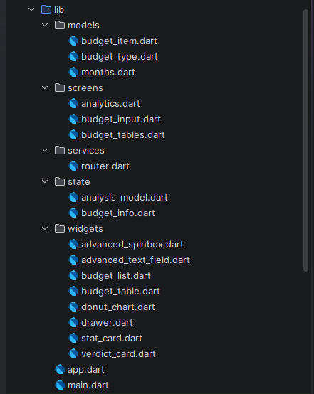
- **models**: Data structures (Budget items, months, etc.)
- **screens**: The different pages that you navigate to
- **services**: As of now its just `router.dart` which houses the GoRouter
- **state**: All the state the app uses throughout its lifetime (uses Signals)
- **widgets**: Reusable UI containers used across all screens
- **app.dart**: Contains the main class for the entire app
- **main.dart**: Starting point